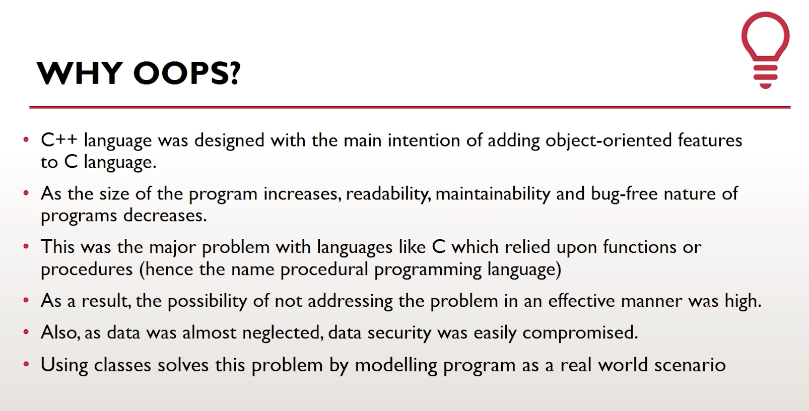
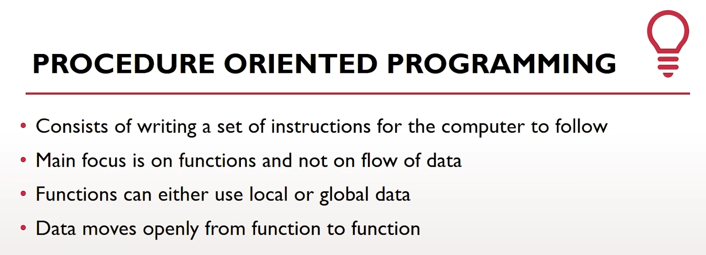
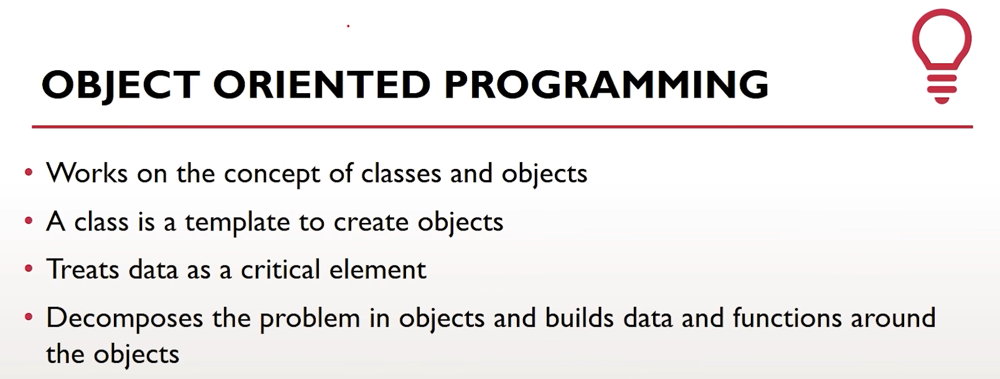
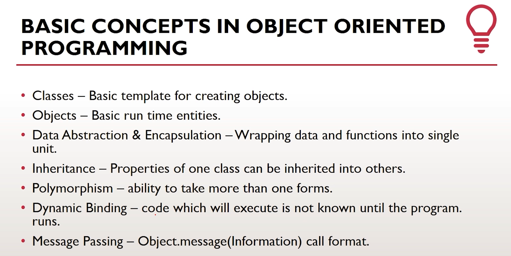
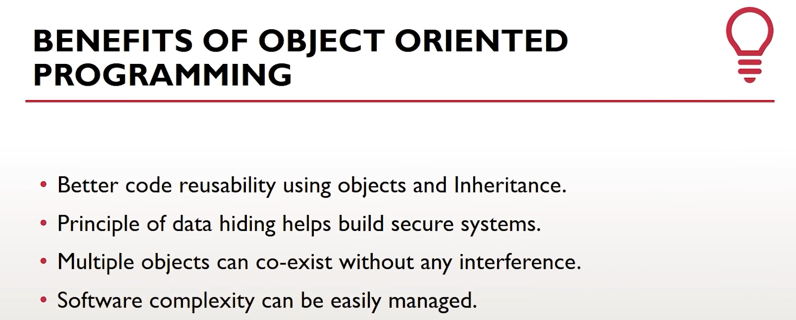

**Date :** `24-12-2022`
# Lecture - 19 & 20 Summary
## Lecture - 19 Topic : Function Overloading C++

Function overloading is a feature of object-oriented programming where two or more functions can have the same name but different parameters(formal parameters). When a function name is overloaded with different jobs it is called Function Overloading.

Compiler first takes the passed values to the function and match the prototype of the function if prototype match with the given arguments types then that function will execute.

```c++
#include <iostream>
using namespace std;

int sum(int a,int b,int c){
    return a+b+c;
}
int sum(int a, int b){
    return a+b;
}
int main(){
    
    cout<<sum(4,5)<<endl;
    cout<<sum(4,5,7)<<endl;

return 0;
}
```
<br>
<hr>

## Lecture - 20 Topic : Object Oriented Programming in C++

<br><br>

<br><br>

<br><br>

<br><br>

<br><br>

<hr>

📑[All in one file](/Journey_so_far.md)📍
