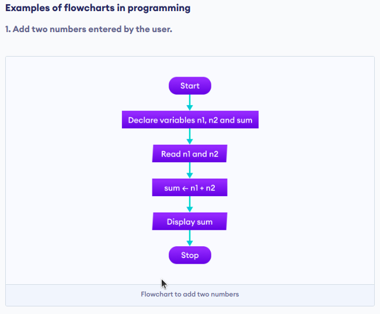

**Date :** `25-12-2022`
## Lecture - 1 Summary
### Topic : Intro to Programming & Flowcharts
```
Program -> Solution
```
Breaking down problem to reach Solution :<br>
**1. Flowchart / Pseudo code** <br>
**2. Writing Program in High Level Language**

#### Flowchart : Flowchart are basically graphical representaion of an approach.
Algorithms are nothing but sequence of steps for solving problems. So a flow chart can be used for representing an algorithm. A flowchart, will describe the operations (and in what sequence) are required to solve a given problem. You can see a flow chart as a blueprint of a design you have made for solving a problem.

#### Flowchart Components :




<br><br>

**Psuedo code :**<br>
**Sum of 2 numbers :**<br>
-> Read 2 number a & b<br>
-> sum = a+b<br>
-> print sum<br>
<br>
**We can also write this in this way too :**<br>
-> Read a<br>
-> Read b<br>
-> Let sum =0<br>
-> sum = a+b<br>
-> print sum<br>

Both ways are right ✔️. Psuedo code are just generics they are just way of representing the flow of a program execution.
