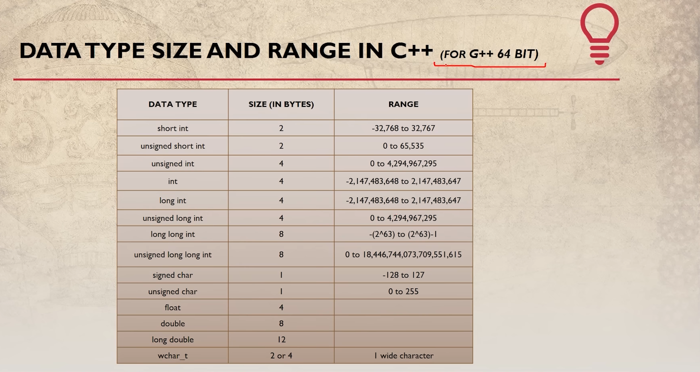

# 💭10 minutes a day keep procastination away💯
# Day 1
**Date :** `10-12-2022`
## Lecture - 1 & 2 Summary
Founder of c++ is Bjarne Stroustrup in ,1979<br>
### C++ features
- High performance
- More control on system resources , on the other hand if we try to do same thing in java or python then 
there will be a intermediate to communicate to the hardware which is why c++ is faster.
- Memory management

### C++ major updates
- 2011 -> C++11
- 2014 -> C++14
- 2017 -> C++17

#### First Program
```c++
#include<iostream>
int main(){
    std::cout<<"Hello world\n";
    return 0;
}
```

Here `#include` work as a import keyword to include header files in our code.

`<iostream>` is a header file name, eveything inside angle brackets are known as header file.

Header files provide us various functonalities and each header file have some purpose in the code.

Like `<iostream>` provide input output functionalities for us.


`int` is a integer , here int work as a return type for a function . 

`main()` is a function , which is a entry point for every program and here main() function will return 0
because as you can see in the above code sample main() function return type is int.

`()` tells the compiler that the given identifier is a function. Every function ends with parenthesis `()` 

And in these parenthesis we can also declare parameters that will be used while calling a function or we can left it empty just like in main() function.
 >The values that are declared within a function when the function is called are known as an argument. Whereas, the variables that are defined when the function is declared are known as a parameter.
 

`std::cout` is function inside std .We can also use `cout` but for that on the second line out of the main function 
we need to add a extra line i.e `using namespace std`

`<<` these angle brackets in C++ are called **insertion operator** .
```c++
#include<iostream>
using namespace std;
int main(){
    cout<<"Hello world\n";
    return 0;
}
```
`::` this symbol is called space resolution operator.<br>
<hr>

# Day 2
**Date :** `11-12-2022`
## Lecture - 3 Summary
### Topic - Variables & Comments
Variables are just containers which help us to store data.

Comments `//` is a way of coveying message to the compiler that you don't need to compile this part of line.

`//` is used as single line comment. For mutiple line comments we use `/**/` everything written between these two asterisk will not be compiled by the compiler.
<hr>

## Lecture - 4 Summmary
### Topic - Variables Scope and Data Types
Variables can be of different types. Primarily we have these variable types in C++:
- int
- Float
- Char
- Double
- Boolean

#### Syntax for declaring variables in C++
>Data_type Variable_name = Value;

int a =4;

##### Based on scope variables can be classified into two types:
1. Local Variable
2. Global Variable

**Variable scope** : Scope of a variable is a region in code where the existence of variable is valid.
  
  **Local Variables** : Local variables are declared inside the braces of any function and can be accessed only from there.<br>
  **Global Variables** : Global variables are declared outside any function and can be accessed from anywhere.

### Data types in C++ are categorised in three groups:
  - Bult-in
  - User-defined
  - Derived

#### Built-in Data types in C++:
`int`  `float`  `char`  `double`  `bool`


#### User-defined Data types in C++:
`Struct`  `Union`  `Enum`


#### Derived Data types in C++:
`Array`  `Function`  `Pointer`

<br>
<hr>

# Day 3
**Date :** `12-12-2022`
## Lecture - 5 Summary
### Topic : Basic I/O in C++

In C++ sequence of bytes corresponding to input and  output are commonly known as **streams**.

**Input Stream** : Direction of flow of bytes takes place from input device (e.g. Keyboard) to the main memory.<br>
**Output Stream** : Direction of flow of bytes takes place from main memory to the output device (e.g. Display)

**Insertion Operator** `<<`: Whatever output is generated show it to the screen that's the role of insertion operator.<br> 
**Extraction Operator** `>>`: Whatever input is given take it, that's the role of extraction operator.



<br>
<hr>

# Day 4
**Date :** `13-12-2022`
## Lecture - 6 Summary
### Topic : C++ header files & operators in C++

There are two types of header files:
1. System header files : It comes with the compiler.
2. User defined header files : It is written by the programmer.<br>
   Syntax of user defined header files<br>
   `include "this.h";`<br>
   `h` is the extension of header files .
   
   One thing need to be insured that any user defined files that is used by program must be defined in the current working directory.

[C++ reference webiste](https://en.cppreference.com/w/cpp/header)

I already know types of operators because of Java , so I will not include the repetitive stuff.

<br>
<hr>

# Day 5

**Date :** `14-12-2022`
## Lecture - 7 Summary
### Topic : Reference Variables & Typecasting

By default the scope of each variable is local , to call the global variable we use `::` scope resolution operator .<br>
By default decimal literal _( e.g. 3.45 )_ is `double` to let the compiler know that given number is float we use `f or F` suffix _( e.g. 3.45f )_.<br>
Same goes with `long` .
```c++
float = 3.45f;
long double = 3.45l; //This is long double, this doesn't exist in java.
```
To know the size of a datatype we use `sizeof()` keyword , enter the value in parenthesis which you want to check.<br>
>Note: The size of a datatype differs compiler to compiler.

**Reference Variable** : In short words , we can say a man with multiple names but all those names belong to single person and when we call with any name that is related to that person ,that person will respond to the call .

**Code:**
```c++
int main(){

    int a =45;
    int &b = a;

    cout<<"Output of a : "<<a<<endl;
    cout<<"Output of b : "<<b<<endl;
    b = 50;
    cout<<"Output of a : "<<a<<endl;

    return 0; 
}
```
**Output:**
```
Output of a : 45
Output of b : 45
Output of a : 50
```

**TypeCasting** : The term is enough to explain it concept. In simple words, the process of converting one datatype into another datatype manually.<br>
```c++
float b = 55.67;
int c = (int)b;
```
<br>
<hr>

# Day 6

**Date :** `15-12-2022`
## Lecture - 8 & 9 Summary

### Lecture - 8 Topic : Constants, Manipulators & Operator Precedence

**Constant** : Constant is helpful when you don't want to let other change your variable value.<br>

```c++
int a =45;
cout<<"The value of a : <<a<<endl;
a =55;
cout<<"The value of a : <<a<<endl;
```
As you can see in the above example the value can be changed easily, to stop that we use constant.

```c++
const int a =45;
cout<<"The value of a : " << a <<endl;
a =43; //This will throw error because we cannot change the value of 'a' here because now 'a' is constant 
```

**Manipulators** : Manipulators in C++ are those operators which help us to format (display format on the screen) our code .<br>
Commonly used two manipulators : `endl` `setw()`<br>
>`setw()` comes from `iomanip` 

Code:
```c++
#include <iostream>
#include <iomanip>
using namespace std;

int main()
{

    int w = 1, x = 22, y = 333, z = 4444;
    cout << "The value of w is :" << setw(4) << w << endl;
    cout << "The value of x is :" << setw(4) << x << endl;
    cout << "The value of y is :" << setw(4) << y << endl;
    cout << "The value of z is :" << setw(4) << z << endl;
    return 0;
}
```

Output:
```
The value of w is :   1
The value of x is :  22
The value of y is : 333
The value of z is :4444
```

Operator precedence is easily available on internet.

<hr>

## Lecture - 9 Topic : Control Structures
In C++ basic control structures are of three types:<br>
1. Sequence Structure
2. Selection Structure
3. Loop Structure
    
### Explaination of each control structure
**1. Flow of Sequence Structure** :<br>
    `Entry -> Perform Action 1 -> Performa Action 2 -> and so on..... -> Exit`

**2. Flow of Selection Structure** :<br>

    Entry ->check conditon--> if true --> perform Action 1 -> Exit
                              ||
                              || if false
                              ||
                              \/
                      perform Action 2 
    
Just like if-else condition.

**3. Flow of Loop Structure** :<br>
    
    Entry -> check condition -> if true =============
             ||           /\                         ||
             ||if false   ||                         ||
             ||           ||Loop                     ||
             \/           ||                         \/ 
           Exit            =================== Perform Action
    


    

<br>
<hr>

# Day 7

**Date :** `16-12-2022`
## Lecture - 10 Summary 
### Topic : While & do-while loops in C++

There are 3 types of loops in C++:
1. for loop
1. while loop
1. do-while loop

**for loop syntax :**

    for(intilization; condition ; updation){
    
        loop body(C++ code);
    
    }
    
**while loop syntax :**

    initilization;
    while(condition){
    
        loop body(C++ code);

        updation;
        
    }

**do-while loop syntax :**

    initilization;
    do {
    
        loop body(C++ code);

        updation;
        
    } while(condition);

<br>
<hr>

# Day 8

**Date :** `17-12-2022`
# Lecture - 11 & 12 Summary
## Lecture - 11
### Topic : Break & Continue Statements

**`break` keyword use :**

```c++
int main()
{

    for (int i = 1; i <= 5; i++)
    {
        if (i == 3)
        {
            break;
        }
        cout <<"The value of i is : "<< i << endl;  
    }

    return 0;
}
```

**Output:**
```
The value of i is : 1
The value of i is : 2
```
`break` keyword is used to stop the loop at a certain condition defined by us. <br><br>


**`continue` keyword use:**
```c++
int main()
{

    for (int i = 1; i <= 5; i++)
    {
        if (i == 3)
        {
            continue;
        }
        cout <<"The value of i is : "<< i << endl;
    }

    return 0;
}
```
**Output:**
```
The value of i is : 1
The value of i is : 2
The value of i is : 4
The value of i is : 5
```

`continue` keyword is used to skip statements written after continue just like above example we skipped the output for `i =3` . <br>

<hr>
<!--=================================================================================================================================================-->

## Lecture - 12
### Topic : Pointer

**What is a Pointer ?**
>In simple words, Pointer is a datatype which holds the address of other data types.

How to create pointer ?<br>
example :
```c++
int a =3;
int* b = &a;
cout<<"The address of a is : "<<&a<<endl;
cout<<"The address of a is : "<<<b<endl;
```
**Output:**<br>

    The address of a is : 0x7ffcefc2a40c
    The address of a is : 0x7ffcefc2a40c
    
`&` --> **_Address of_**  operator<br>
`*` --> `Dereference` operator also called **_value of_**  operator or we can also say ***value at*** operator.   <br>

**Pointer to Pointer :**
```c++
int a =3;
int* b = &a;
int** c = &b;
cout<<"The address of b is : "<<&b<<endl;
cout<<"The address of b is : "<<c<<endl;
cout<<"The value at address c is : "<<*c<<endl;
cout<<"The value of address value_at(value_at(c)) is : "<<**c<<endl;

```

**Output :**
```
The address of b is : 0x7ffc837a3fa8
The address of b is : 0x7ffc837a3fa8
The value at address c is : 0x7fffc0fa5474
The value of address value_at(value_at(c)) is : 3
```
So here pointer to pointer means

```
pointer c holds address of b --> pointer b --> holds the address of 'a' variable and as we already know the variable 'a' sotres a value.
```

So when we say `*c` we are actually telling the compiler that : show us the address which stored by b pointer variable and in according to above case it will return only address stored by b pointer variable(which is address of `a` variable) .<br>
Conclusion of above statement :<br>
*c == &a(which is hold by `b` pointer) Or we can also say *c == b (adrres of `a` (&a) i.e. is present inside this `b` pointer).<br><br>

And when we say `**c` we are telling the compiler that : show us the value stored at the address of the address which is present inside 'c' pointer.<br>
Conclusion of above statement:<br>
`**c == *b` <br>
I know it's quite consfusing I will try my best to solve your confusion with the help of below diagrams.<br>
<br><br>
When we use `&` operator it tells us the address of the variable.<br>
When we use `*` operator as a suffix with a pointer variable it tells us the value stored at that address which is present inside the pointer(e.g. int* b = &a).<br>
When we use `**` double pointer or we can say pointer to pointer as a suffix with a variable then we are telling the compiler that store the address of a pointer(variable b) inside a pointer( variable c). <br>

```c++
int a  = 3;
int* b = &a;
```
**Diagram:**
        
         ___
        | 3 |
        |___|
          a
          /\
          ||
          ||
          ||
         ______________  
        |              |
        | Address of a |
        |______________|
               b 
<br><br>          
```c++
int a  = 3;
int* b = &a;
int** c = &b;
```
**Diagram:**
        
         ___
        | 3 |
        |___|
          a
          /\
          ||
          ||
          ||
         ______________  
        |              |
        | Address of a |
        |______________|
               b 
              /\
              ||
              ||
              ||
         ______________  
        |              |
        | Address of b |
        |______________|
               c 
          
<br><br>
So when we say ` cout<< c `<br>
The output will be: The address of 'b' pointer which is stored by 'c' pointer.<br>
**Diagram:**
        
         ______________  
        |              |
        | Address of b |
        |______________|
               c 
<br><br>
When we say ` cout<< *c `<br>
The output will be: The address present inside 'b' pointer.<br>
**Diagram:**

         ______________  
        |              |
        | Address of a |  
        |______________|  <===============|
               b                          |
                                          |
                                          |
                                          |      In this case the `c` pointer will call the address stored by pointer `b`  
                                          |
         ______________                   | 
        |              |                  |
        | Address of b | =================
        |______________|
               c 

<br><br>
When we say ` cout<< **c `<br>
The output will be :<br>
**Diagram:**

         ___
        | 3 |<============||
        |___|             ||
          a               /\
         ______________   ||
        |              |  ||
        | Address of a |  <=============== 
        |______________|                  |
               b                          |
                                          |
                                          |
                                          |      In this case 'c' pointer will call the value of the address which is present 
                                          |      inside 'b' pointer i.e value stored by variable 'a'
         ______________                   | 
        |              |                  |
        | Address of b | =================
        |______________|
               c 


<br>
<hr>

## Thank you so much for reading this so far 🥺.See you next time because 

